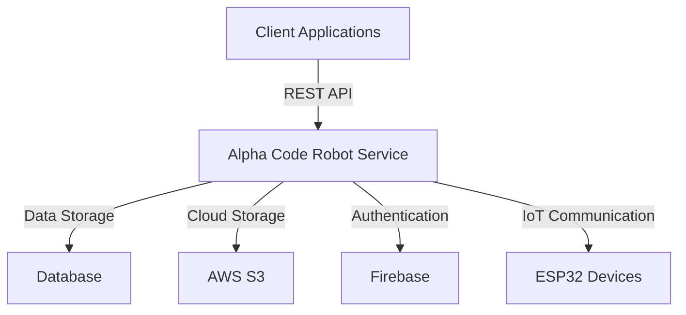

# Alpha Code Robot Service

## Description
Alpha Code Robot Service is a robust and scalable backend service designed to manage and control robotic devices. Built with Spring Boot, it provides APIs for managing robots, handling video capture, and integrating with IoT devices like ESP32. This service is optimized for high performance and extensibility, making it ideal for modern robotics applications.

---

## Introduction
The Alpha Code Robot Service is the backbone of the Alpha Code robotics ecosystem. It facilitates seamless communication between robotic devices and the cloud, ensuring efficient data processing, device management, and real-time operations. With its modular architecture, the service is easy to extend and customize for various use cases.

---

## Key Features
- **Robot Management**: APIs for creating, updating, and managing robot entities.
- **Video Capture**: Support for video streaming and storage.
- **IoT Integration**: Seamless communication with ESP32 devices.
- **Rate Limiting**: Built-in IP rate limiting for enhanced security.
- **Cloud Integration**: AWS S3 and Firebase support for storage and authentication.
- **OpenAPI Documentation**: Comprehensive API documentation with Swagger.
- **Extensible Architecture**: Modular design for easy customization.

---

## Overall Architecture

The architecture is designed to ensure scalability, reliability, and ease of integration with third-party services.

---

## Installation
### Prerequisites
- Java 17 or higher
- Maven 3.8+
- Docker (optional, for containerized deployment)

### Steps
1. Clone the repository:
   ```bash
   git clone https://github.com/your-org/alpha-code-robot-service.git
   ```
2. Navigate to the project directory:
   ```bash
   cd alpha-code-robot-service
   ```
3. Build the project:
   ```bash
   ./mvnw clean install
   ```

---

## Running the Project
### Local Environment
Run the application locally:
```bash
./mvnw spring-boot:run
```

### Dockerized Environment
Build and run the Docker container:
```bash
docker build -t alpha-code-robot-service .
docker run -p 8080:8080 alpha-code-robot-service
```

---

## Environment Configuration
The application uses the following environment variables:
- `SPRING_PROFILES_ACTIVE`: Set the active Spring profile (e.g., `dev`, `prod`).
- `AWS_ACCESS_KEY_ID` and `AWS_SECRET_ACCESS_KEY`: AWS credentials for S3 integration.
- `FIREBASE_CONFIG_PATH`: Path to the Firebase service account JSON file.

Example `.env` file:
```env
SPRING_PROFILES_ACTIVE=dev
AWS_ACCESS_KEY_ID=your-access-key
AWS_SECRET_ACCESS_KEY=your-secret-key
FIREBASE_CONFIG_PATH=src/main/resources/firebase/firebase-service-account.json
```

---

## Folder Structure
```plaintext
alpha-code-robot-service/
├── src/
│   ├── main/
│   │   ├── java/com/alpha_code/alpha_code_robot_service/
│   │   │   ├── config/        # Configuration files
│   │   │   ├── controller/    # REST controllers
│   │   │   ├── dto/           # Data Transfer Objects
│   │   │   ├── entity/        # JPA entities
│   │   │   ├── service/       # Service layer
│   │   │   ├── repository/    # Data repositories
│   │   │   ├── util/          # Utility classes
│   │   └── resources/         # Application resources
│   └── test/                  # Test cases
├── Dockerfile                 # Docker configuration
├── pom.xml                    # Maven configuration
└── README.md                  # Project documentation
```

---

## Contribution Guidelines
We welcome contributions! To get started:
1. Fork the repository.
2. Create a new branch for your feature or bugfix:
   ```bash
   git checkout -b feature/your-feature-name
   ```
3. Commit your changes:
   ```bash
   git commit -m "Add your commit message"
   ```
4. Push to your branch:
   ```bash
   git push origin feature/your-feature-name
   ```
5. Open a pull request.

Please ensure your code adheres to our coding standards and includes tests where applicable.

---

## License
This project is licensed under the MIT License. See the [LICENSE](LICENSE) file for details.

---

## Roadmap
- **Q1 2026**: Add support for MQTT communication.
- **Q2 2026**: Implement advanced analytics for robot performance.
- **Q3 2026**: Introduce multi-language support.
- **Q4 2026**: Enhance security with OAuth2 integration.

Stay tuned for updates!

---

For more information, visit our [documentation site](https://example.com/docs) or contact us at support@example.com.

